## 📘프로젝트 개요

## 📌주요기능

## 📗유스케이스

 1.	메인화면 유스케이스

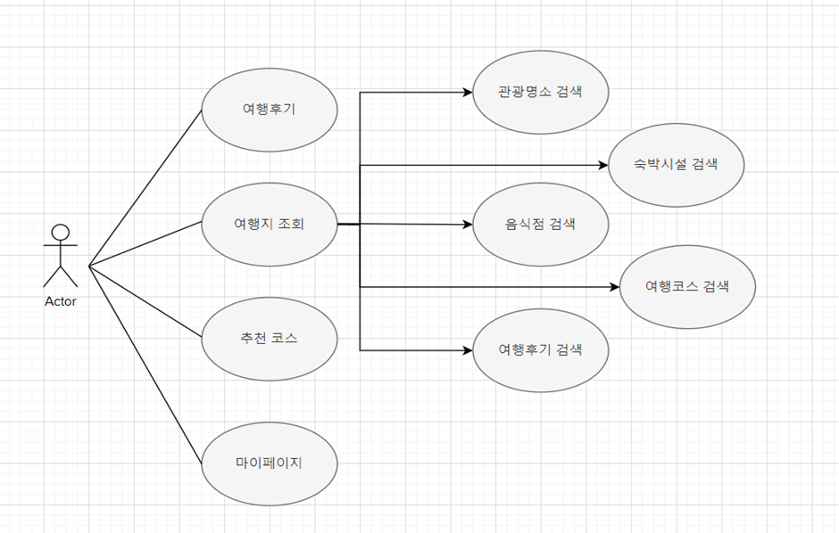

2.	여행계획 관리 유스케이스

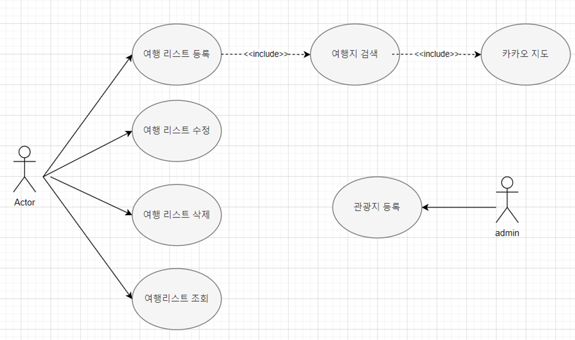

3.	추천 코스 유스케이스

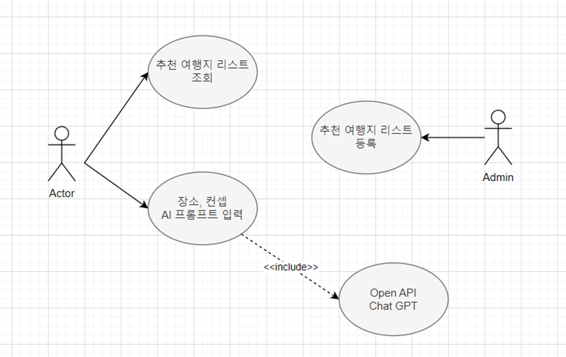

4.	기본관리 유스케이스

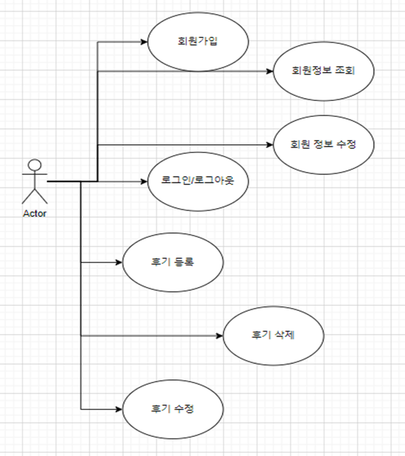

## 📗테이블 구조도 ERD

 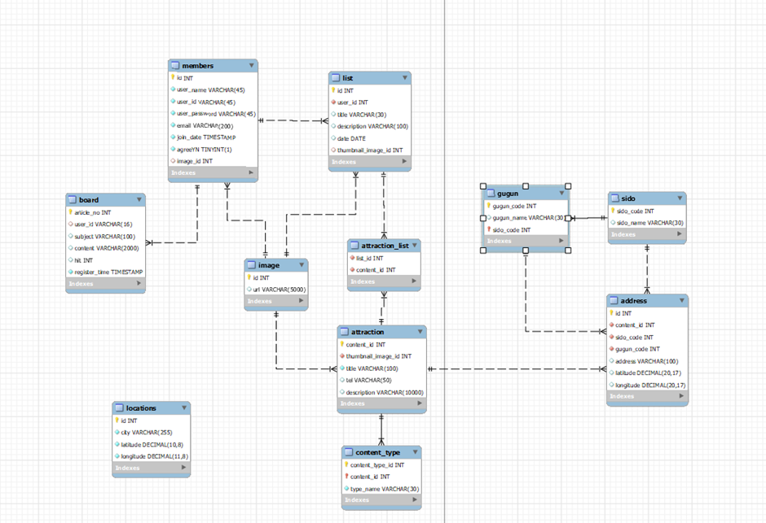

## 기술스택

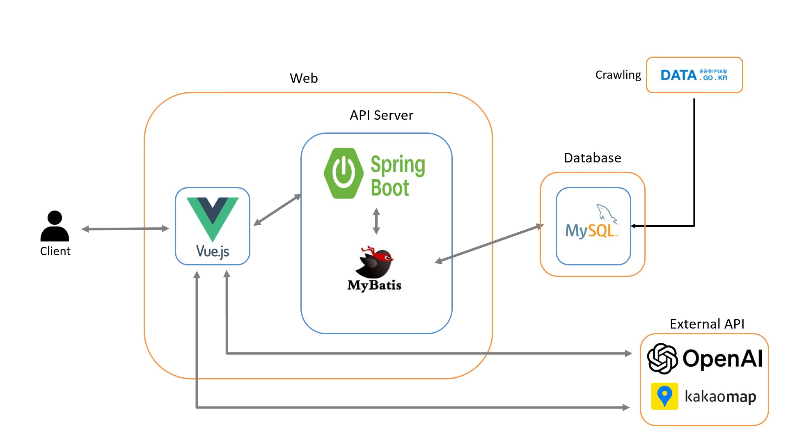

## 📗화면 설계서

### 메인 페이지

- 메인화면(1) 

 

- 메인화면(2)

 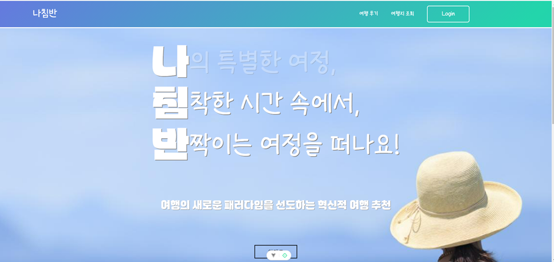

- 메인화면(3) 

 

### 로그인 회원가입 페이지

  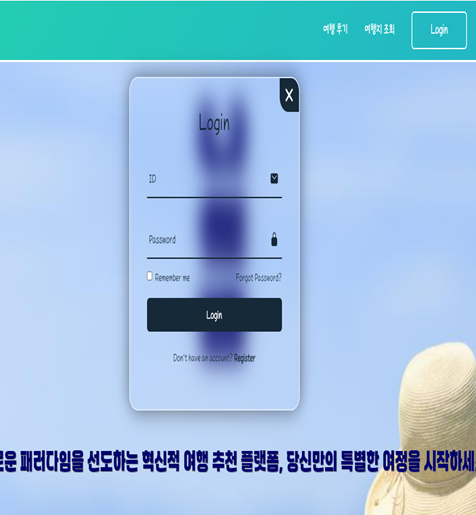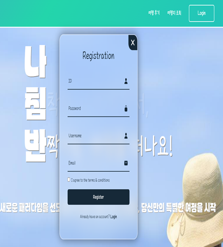

### 여행후기 페이지

- 후기작성

 

- 후기 조회

 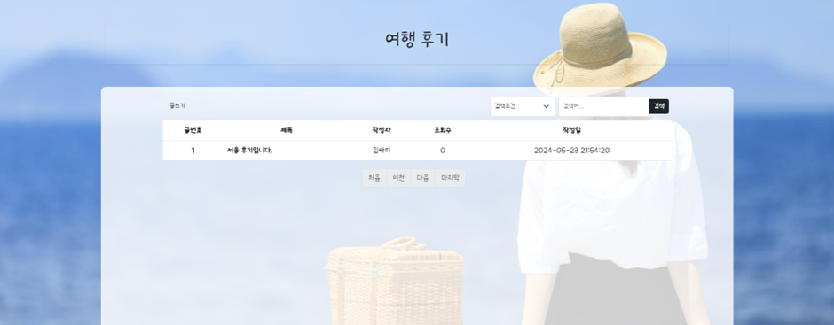

- 후기 상세조회

 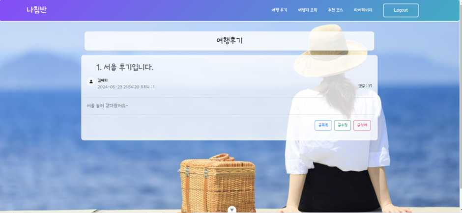

- 후기 수정

 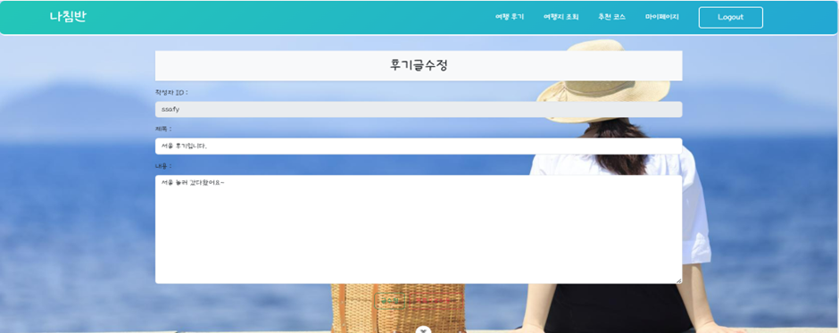

### 여행지 조회 & 여행 계획 페이지

- 여행지 조회

 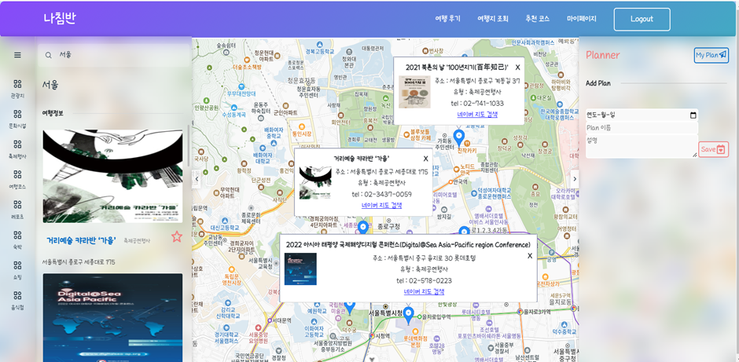

- 여행지 리스트 등록

 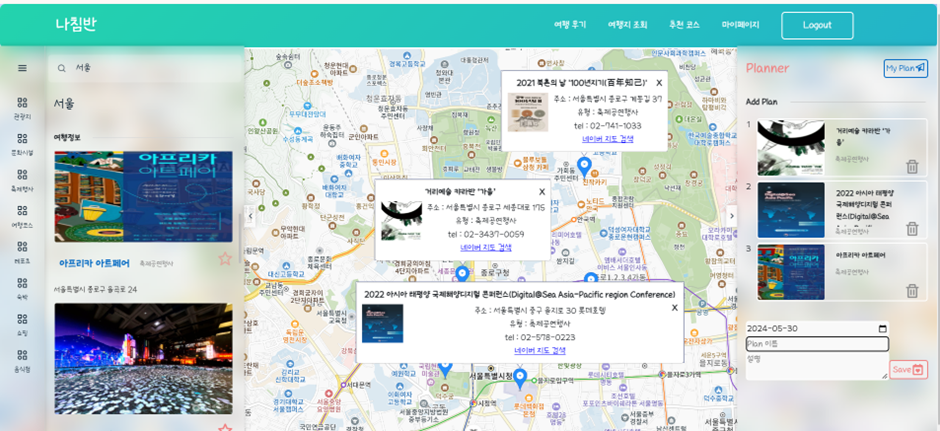

- 여행지 리스트 조회

 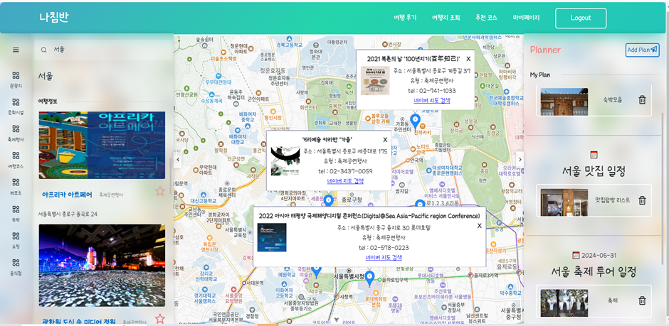

### 추천코스 페이지

 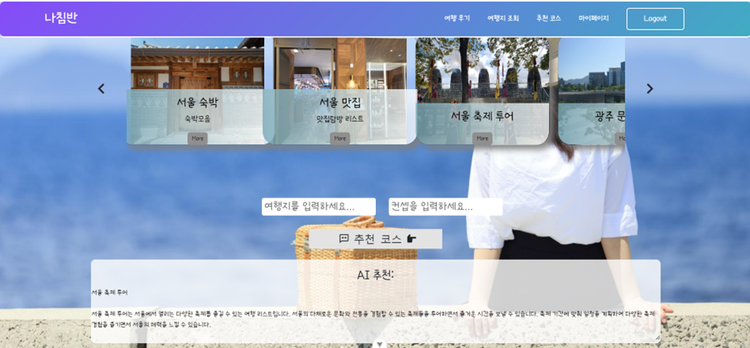

### 마이페이지 

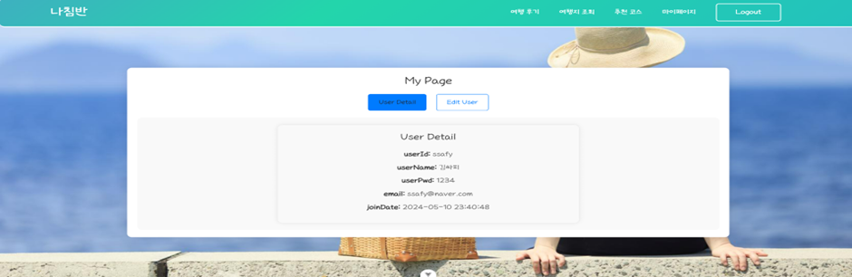
