1.	유스케이스
1.	메인화면 유스케이스
 
2.	여행계획 관리 유스케이스
 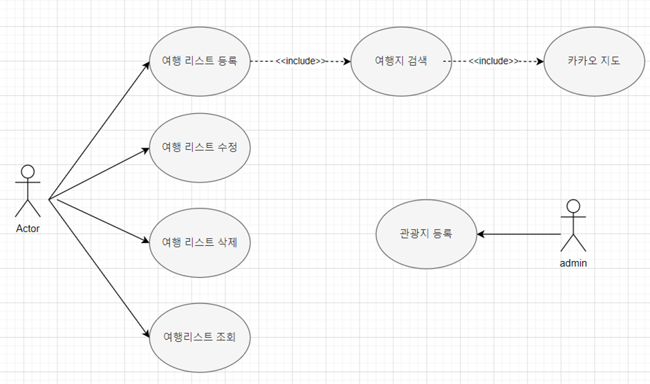
3.	추천 코스 유스케이스
 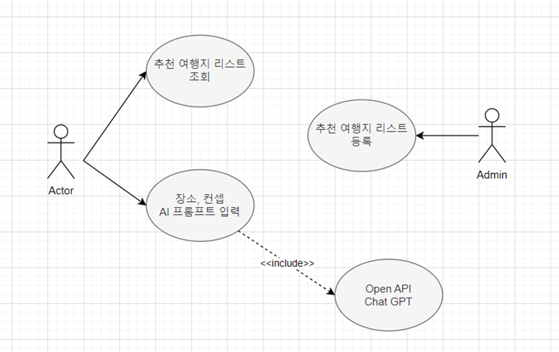
4.	기본관리 유스케이스
 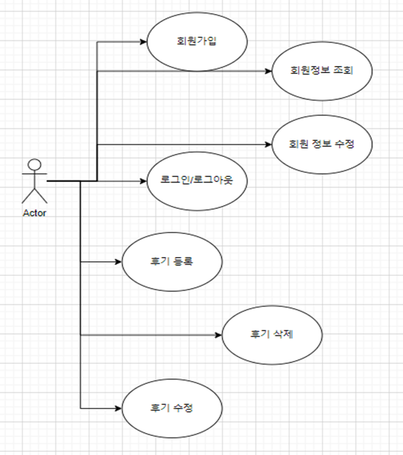
2. 테이블 구조도 ERD
 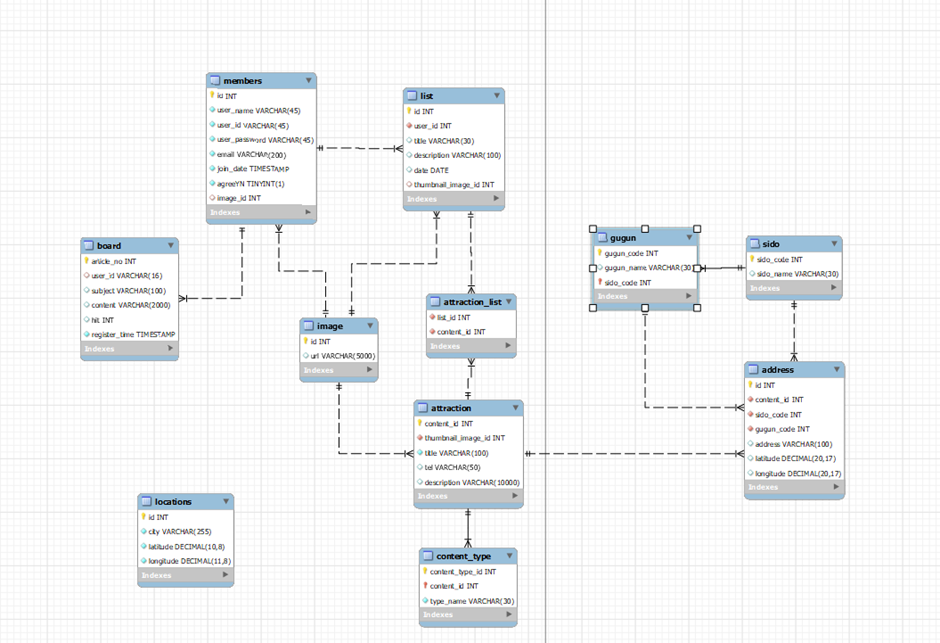
3. 클래스 다이어그램
 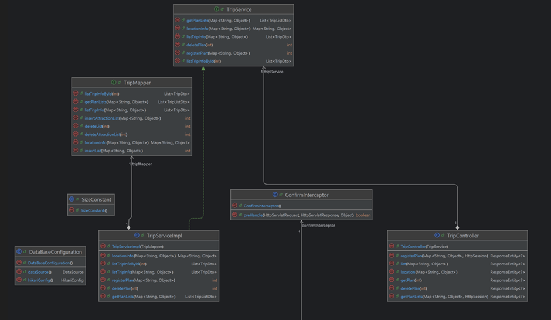
 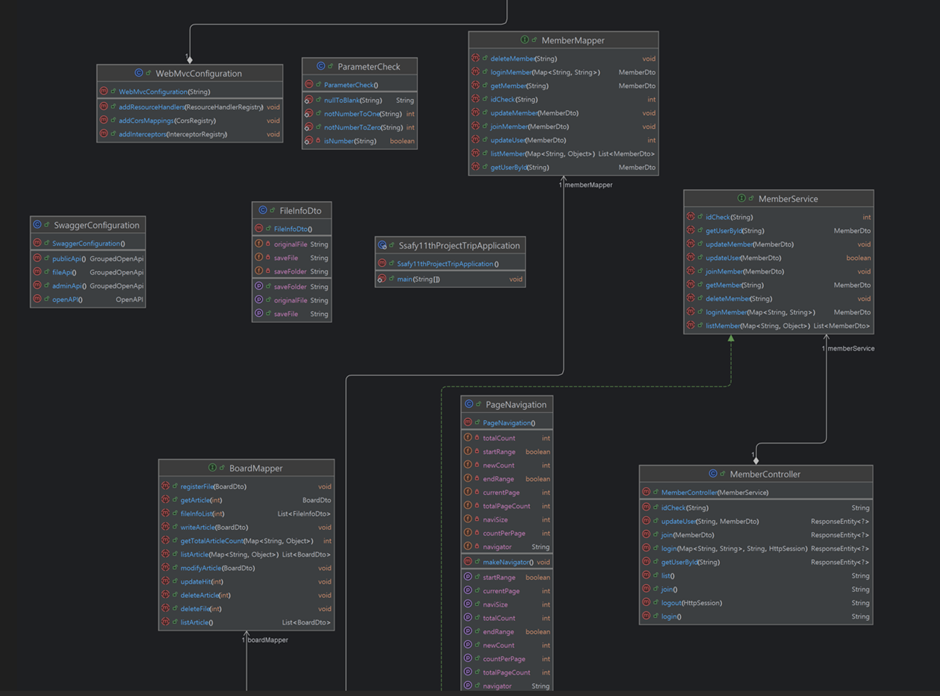
 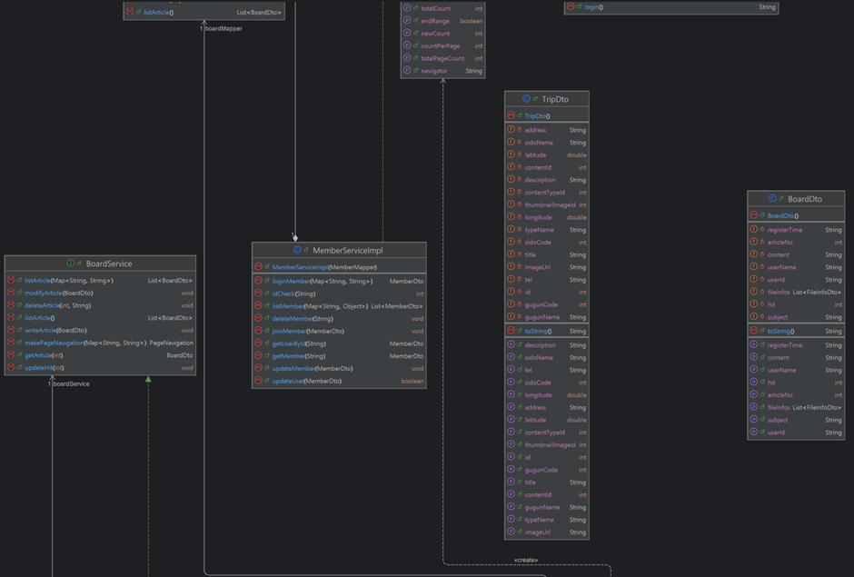
 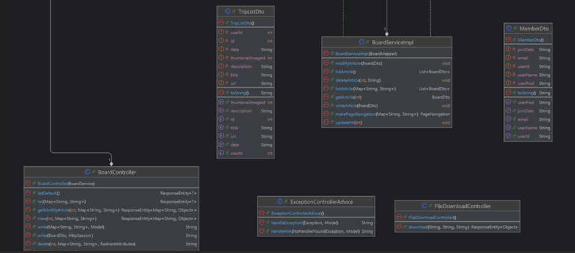

4. 화면 설계서
메인 페이지
- 메인화면(1) 
 

메인화면(2)
 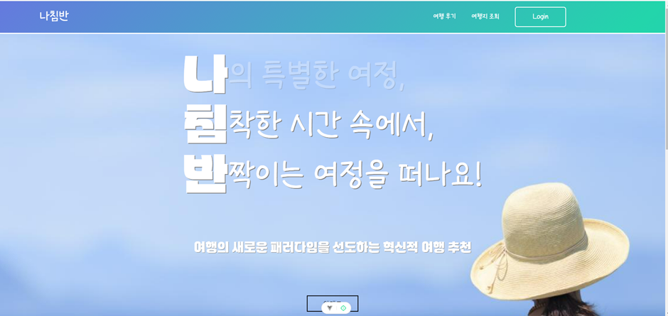
메인화면(3) 
 
로그인 회원가입 페이지
  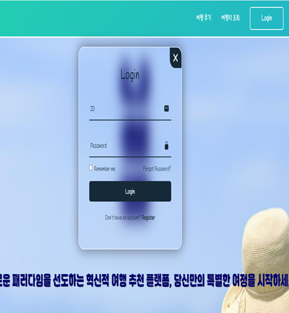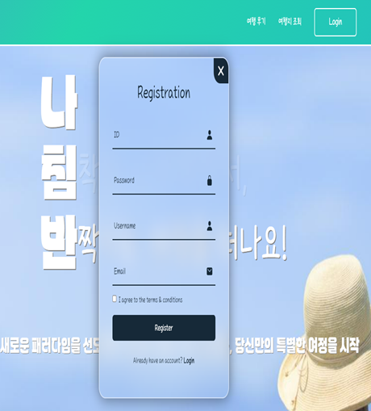
여행후기 페이지
후기작성
 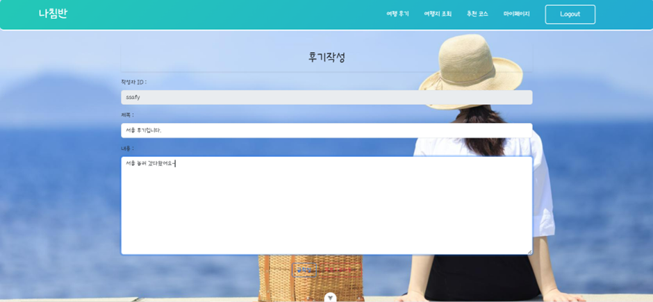
후기 조회
 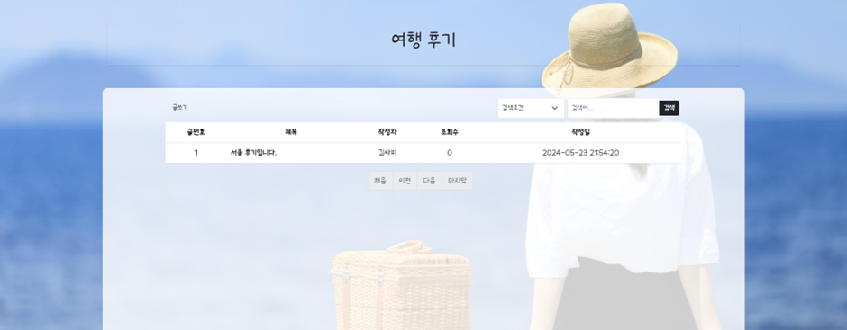
후기 상세조회
 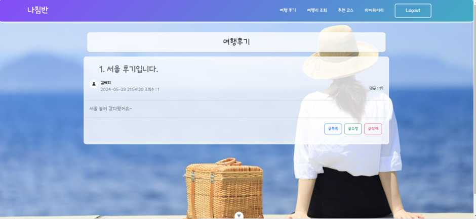
후기 수정
 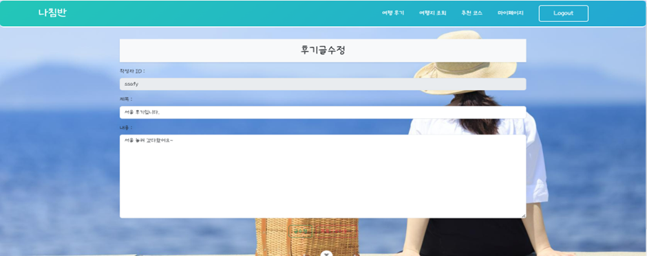

여행지 조회 & 여행 계획 페이지
여행지 조회
 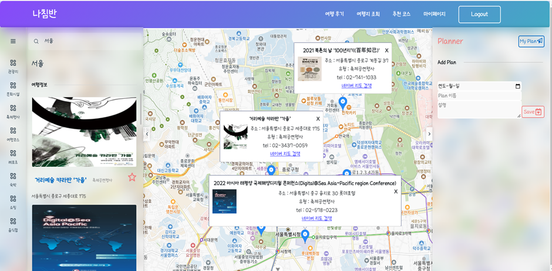
여행지 리스트 등록
 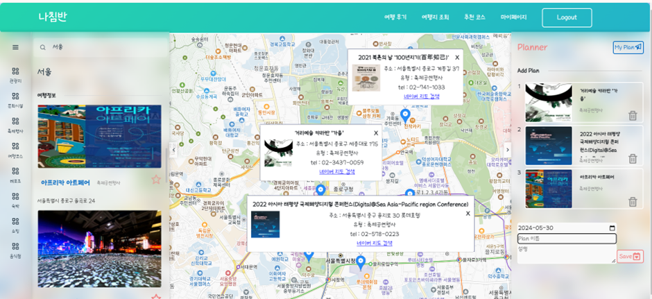

여행지 리스트 조회
 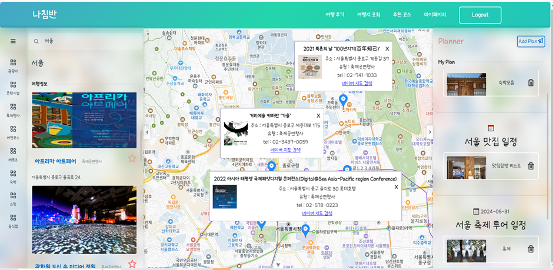
추천코스 페이지
 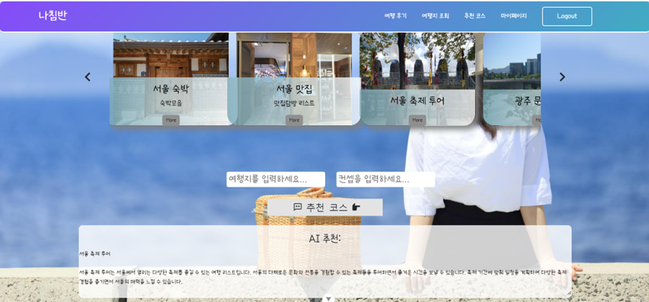
마이페이지 
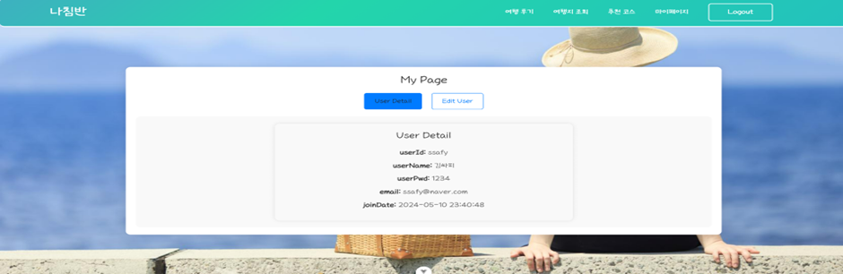
